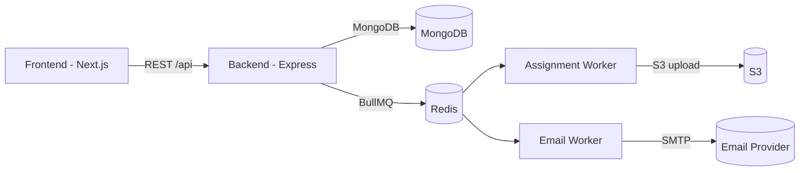

# VedaAI - Full Stack Engineering Assignment

**Role:** Full Stack Engineer

**Duration:** 21 March (11:59PM)

**Submission:** GitHub Repository + Deployed link

---

## Overview

Build an AI Assessment Creator based on the provided Figma designs. The system allows a teacher to:

- Create an assignment
- Generate a question paper using AI
- View the generated output

Figma: [VedaAI - Hiring Assignment](https://www.figma.com/design/nB2HMm1BhTpmHcHrmEslGB/VedaAI---Hiring-Assignment?node-id=0-1&t=UjYQLgEek4u99AA4-1)

---

## What I Built

### Core user flow

- Assignment creation with subject selection, question types, counts, marks, difficulty, and instructions.
- Optional PDF upload. Text is extracted and used in the prompt.
- Background job generates questions and builds a PDF.
- Result view with PDF download.

### Production-grade features

- Email verification (OTP) before account activation.
- Email notifications for assignment completion and failure.
- S3 uploads for generated PDFs and source PDFs.
- BullMQ workers for async generation + email delivery.
- Redis-backed queueing and retry support.

### UI enhancements

- Clean, modern UI aligned with Figma.
- Coming Soon pages for Groups, Toolkit, Library, Settings.
- Authenticated sidebar user details.

---

## Tech Stack

**Frontend**

- Next.js 16 + TypeScript
- Zustand (auth state)
- Tailwind CSS + shadcn UI

**Backend**

- Node.js + Express (TypeScript)
- MongoDB (assignments, results, users)
- Redis + BullMQ (jobs)
- Nodemailer (email)
- AWS S3 (PDF storage)
- Gemini/OpenAI-compatible API (question generation)

---

## Architecture



---

## API Endpoints

Base URL: `/api`

### Auth

- `POST /api/auth/signup` - Create pending signup + send OTP
- `POST /api/auth/verify-email` - Verify OTP and create account
- `POST /api/auth/resend-verification` - Resend OTP
- `POST /api/auth/signin` - Sign in and set cookie
- `GET /api/auth/me` - Get current user (auth required)
- `POST /api/auth/logout` - Clear auth cookie

### Subjects

- `GET /api/subjects` - List subjects (auth required)
- `POST /api/subjects` - Create subject (auth required)
    - Body: `{ name, questionTypes: string[] }`

### Assignments

- `POST /api/assignments` - Create assignment (auth + multipart)
    - Form fields:
        - `payload` (JSON string)
        - `pdfFile` (optional)
    - Payload schema:
        - `title`, `subjectId`, `gradeLevel`, `dueDate`, `difficulty`
        - `questionBreakdown[]` with `{ type, count, marksPerQuestion }`
        - `additionalInstructions` (optional)
- `GET /api/assignments` - List assignments with filters
    - Query: `status`, `subjectId`, `gradeLevel`, `search`, `from`, `to`, `page`, `limit`
- `GET /api/assignments/:id` - Assignment details
- `GET /api/assignments/:id/result` - Generated result
- `GET /api/assignments/:id/result/pdf` - Redirect to PDF
- `DELETE /api/assignments/:id` - Delete assignment

---

## Local Setup

### Prerequisites

- Node.js 18+ (20 recommended)
- MongoDB
- Redis

### Backend

1. Install dependencies

```bash
cd backend
npm install
```

2. Create backend env file at `backend/env`

```bash
PORT=8080
FRONTEND_ORIGIN=http://localhost:3000
DB_URL=mongodb://localhost:27017/veda-ai-assignment
REDIS_URL=redis://localhost:6379
JWT_SECRET=your_secret

# AI
GEMINI_API_KEY=your_key
GEMINI_BASE_URL=https://generativelanguage.googleapis.com/v1beta/openai/
GEMINI_MODEL=gemini-3-flash-preview

# S3
AWS_ACCESS_KEY_ID=your_key
AWS_SECRET_ACCESS_KEY=your_secret
AWS_REGION=ap-south-1
AWS_S3_BUCKET=your_bucket
AWS_S3_PUBLIC_BASE_URL=https://your_bucket.s3.ap-south-1.amazonaws.com

# Email
SMTP_HOST=smtp.gmail.com
SMTP_PORT=587
SMTP_USER=your_email
SMTP_PASS=your_app_password
SMTP_FROM=your_email
```

3. Build and run API

```bash
npm run build
npm run start
```

4. Start workers

```bash
node dist/workers/assignment.worker.js
node dist/workers/email.worker.js
```

### Frontend

1. Install dependencies

```bash
cd frontend
npm install
```

2. Create frontend env file at `frontend/.env`

```bash
BACKEND_URL=http://localhost:8080/api
```

3. Run locally

```bash
npm run dev
```

---

## Production Notes

- Start multiple workers with PM2 for scaling:

```bash
pm2 start dist/workers/assignment.worker.js --name assignment-worker -i 4
pm2 start dist/workers/email.worker.js --name email-worker -i 2
```

- If `.env` changes, restart processes:

```bash
pm2 restart all
```

---

## Assignment Brief (Provided)

### Core Features

**1. Assignment Creation (Frontend)**

- File upload (PDF / text) optional
- Due date
- Question types
- Number of questions + marks
- Additional instructions
- Proper validation
- State management with Redux or Zustand

**2. AI Question Generation**

- Convert input into structured prompt
- Generate sections, questions, difficulty, marks
- Do not render raw LLM response

**3. Backend System**

- Node.js + Express (TypeScript)
- MongoDB, Redis, BullMQ
- Background worker flow

**4. Output Page (Enhanced)**

- Student info section
- Sections with instructions
- Difficulty tags
- Clean, readable, responsive layout

---

## Future Improvements

- WebSocket job progress updates
- Rate limits for OTP resend
- Signed S3 URLs (private bucket support)
- Admin dashboard and org accounts

---

## Deployment

A detailed AWS deployment guide is available on request. Recommended stack:

- EC2 (API + workers + Next.js)
- MongoDB Atlas
- S3 for PDFs
- Redis (Upstash or EC2)

---

## Submission

- GitHub Repo with clean setup instructions
- Deployed link

Submission link: https://docs.google.com/forms/d/e/1FAIpQLSeL19GVvVT8vZrTx67hMWKTXLyJSyhkW5XGyzh7Ppt5w8P1jw/viewform?usp=dialog
